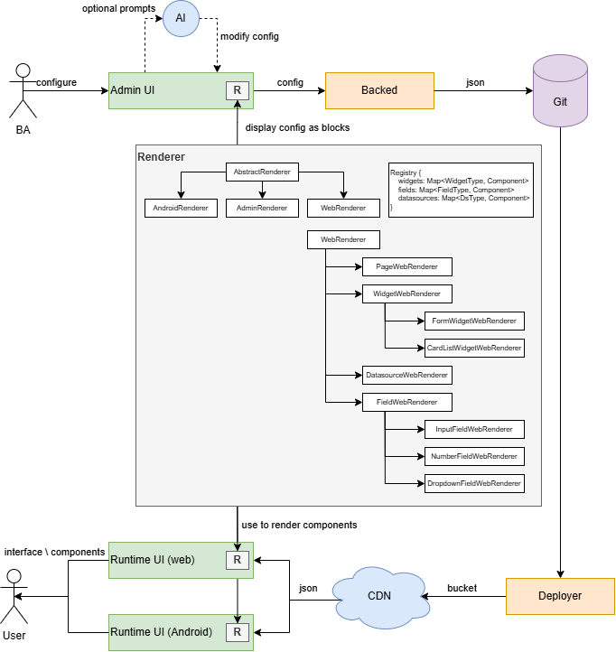

# Low-Code-UI

### Live demo - [https://low-code-ui.stswoon.ru](https://low-code-ui.stswoon.ru)

This is prototype of low code ui which supports:

1. [x] ability to display UI by JSON without need of frontend knowledge
2. [x] ability to ask AI to generate and modify JSON
3. [ ] :construction: **[NOT READY]** ability to drag&drop UI block to skip understanding of json

**Possible Architecture**:

